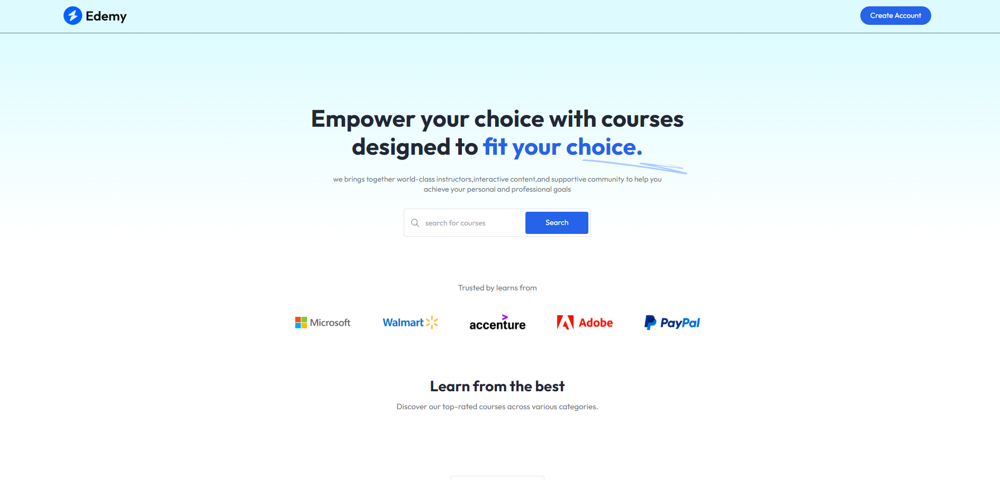
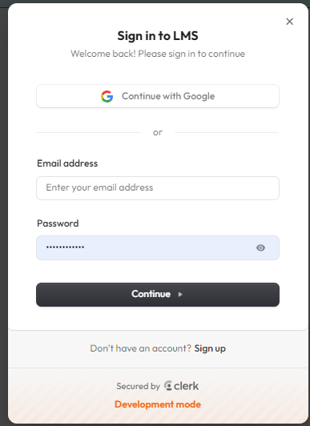
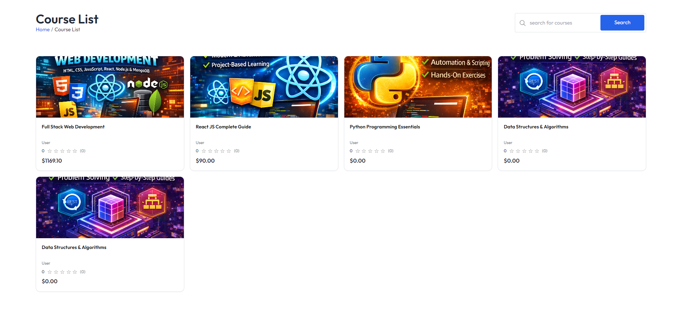
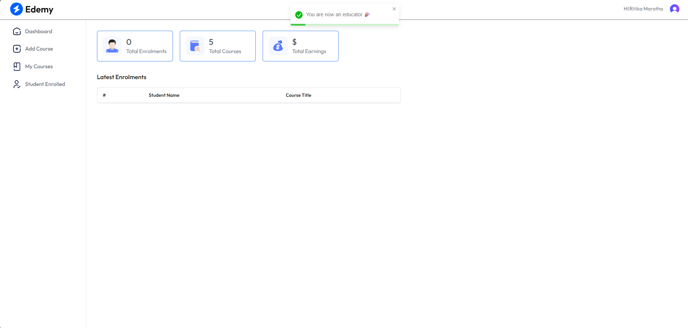
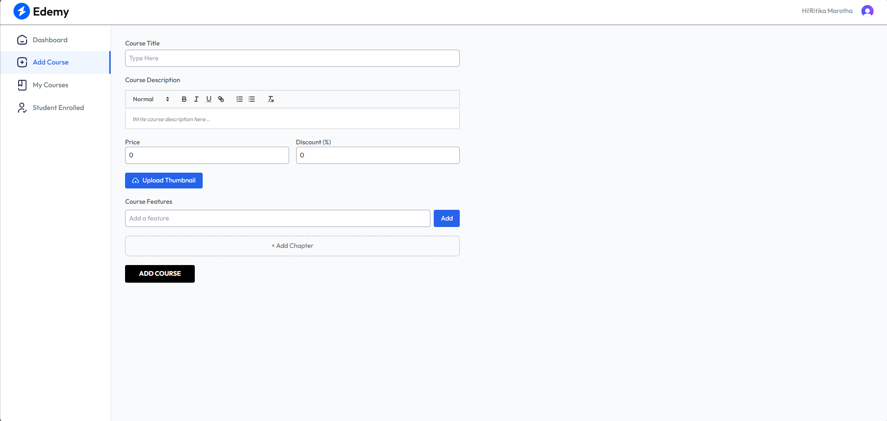
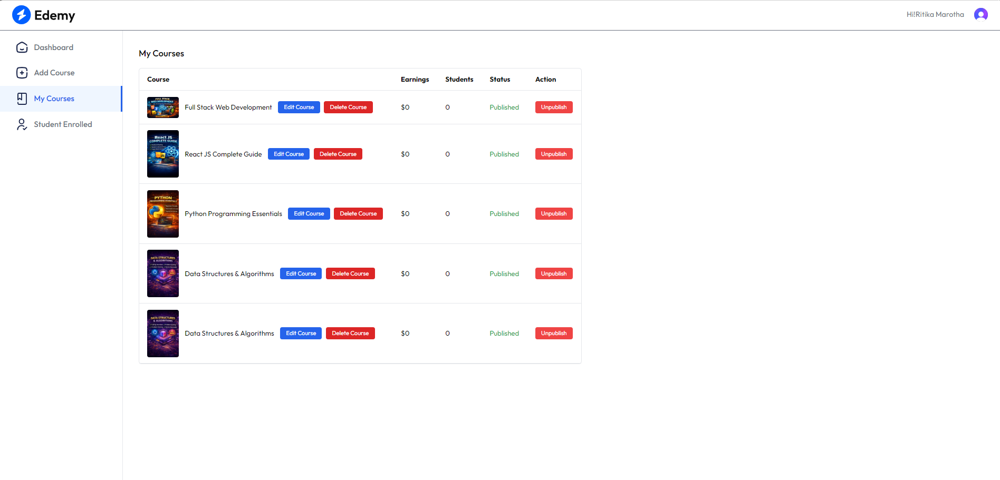
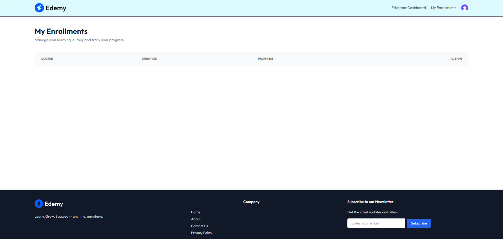
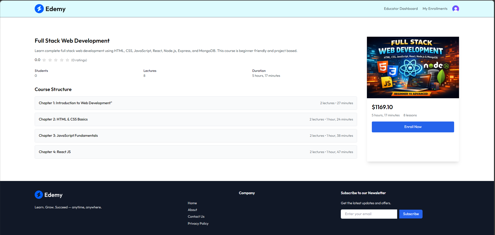

# EduStream | Full-Stack Learning Management System


Edemy is a high-performance, scalable Learning Management System (LMS) designed to empower educators and provide students with a seamless learning experience. Built with the MERN stack and modern UI components, it bridges the gap between content creation and knowledge consumption with integrated secure payments and real-time progress tracking.

## 🚀 Key Features

### For Students
- **Course Discovery:** Advanced search and filtering to find the perfect learning path.
- **Seamless Enrollment:** Instant access to courses via secure Razorpay payment integration.
- **Interactive Learning:** Dedicated video player with lesson navigation and progress persistence.
- **Profile Management:** Secure, passwordless authentication managed by Clerk.
- **My Enrollments:** A centralized dashboard to track all active and completed courses.

### For Educators
- **Course Builder:** Robust tools for creating and organizing multi-lesson courses with Cloudinary-backed media.
- **Analytics Dashboard:** Comprehensive insights into total earnings, student enrollments, and course performance.
- **Student Management:** Detailed lists of enrolled students per course for better engagement tracking.
- **Real-time Updates:** Instant reflection of course modifications across the platform.

## 🏗️ Architecture

```text
D:\LMS(Full stack Project)\
├── client/                 # Frontend (React.js + Vite)
│   ├── src/
│   │   ├── components/     # Reusable UI (Students & Educator specific)
│   │   ├── context/        # Global State Management (AppContext)
│   │   ├── pages/          # Page Components (Home, Dashboard, Player)
│   │   └── assets/         # Static Media & Icons
│   └── tailwind.config.js  # Styling Configuration
└── server/                 # Backend (Node.js + Express)
    ├── configs/            # Database, Multer, and Cloudinary Setup
    ├── controllers/        # Business Logic for Courses, Users, & Webhooks
    ├── models/             # Mongoose Schemas (User, Course, Purchase)
    ├── routes/             # API Endpoints
    └── middlewares/        # Authentication & Authorization Logic
```

## 🛠️ Installation & Environment

### Prerequisites
- Node.js (v16+)
- MongoDB Atlas Account
- Clerk Account (for Auth)
- Razorpay Account (for Payments)
- Cloudinary Account (for Image/Video hosting)

### Steps
1. **Clone the Repository:**
   ```bash
   git clone https://github.com/your-username/lms-full-stack.git
   cd lms-full-stack
   ```

2. **Install Dependencies:**
   ```bash
   # Install Client dependencies
   cd client && npm install
   # Install Server dependencies
   cd ../server && npm install
   ```

3. **Environment Variables:**
   Create a `.env` file in the `server` directory and a `.env.local` in the `client` directory using the templates below.

#### Server `.env.example`
```env
MONGODB_URI=your_mongodb_connection_string
CLOUDINARY_CLOUD_NAME=your_cloud_name
CLOUDINARY_API_KEY=your_api_key
CLOUDINARY_API_SECRET=your_api_secret
CLERK_SECRET_KEY=your_clerk_secret_key
RAZORPAY_KEY_ID=your_razorpay_key_id
RAZORPAY_KEY_SECRET=your_razorpay_key_secret
CLERK_WEBHOOK_SECRET=your_clerk_webhook_secret
```

#### Client `.env.local.example`
```env
VITE_CLERK_PUBLISHABLE_KEY=your_clerk_pub_key
VITE_RAZORPAY_KEY_ID=your_razorpay_key_id
VITE_BACKEND_URL=http://localhost:5000
```

## 📊 Database Schema

- **User Model:** Stores Clerk metadata, role (Student/Educator), and an array of enrolled course references.
- **Course Model:** Contains title, description, rich-text content, pricing, and nested lesson objects with Cloudinary URLs.
- **Purchase Model:** Tracks transaction IDs, user references, amounts, and payment status for financial reporting.
- **CourseProgress Model:** Maps user progress (completed lessons) to specific course enrollments.

## 🖼️ System Walkthrough

| Feature | Screenshot | Description |
| :--- | :--- | :--- |
| **Landing Page** |  | High-performance, responsive landing page built with the **MERN** stack, featuring dynamic hero sections. |
| **User Authentication** |  | Secure, passwordless user authentication and profile management powered by **Clerk**. |
| **Course Catalog** |  | Dynamic course discovery and filtering to find the perfect learning path. |
| **Educator Dashboard** |  | Comprehensive analytics dashboard for educators to manage earnings and track student enrollments. |
| **Course Editor** |  | Robust tools for educators to create and organize multi-lesson courses with ease. |
| **Manage Courses** |  | Management interface for educators to track and modify all their published content. |
| **Student Progress** |  | Real-time progress persistence and lesson completion tracking for students. |
| **Course Details** |  | Detailed course overview, including structured curriculum and enrollment options. |
| **Testimonials** |  | Integrated student testimonials section for social proof and community feedback. |

## 🔮 Future Enhancements
- [ ] **AI-Driven Recommendations:** Personalized course suggestions based on student behavior.
- [ ] **Mobile Application:** Cross-platform mobile app using React Native for learning on the go.
- [ ] **Live Sessions:** Integration with Zoom or WebRTC for real-time educator-student interaction.
- [ ] **Gamification:** Achievement badges and leaderboards to increase student engagement.

---
*Built with ❤️ for the next generation of learners.*
